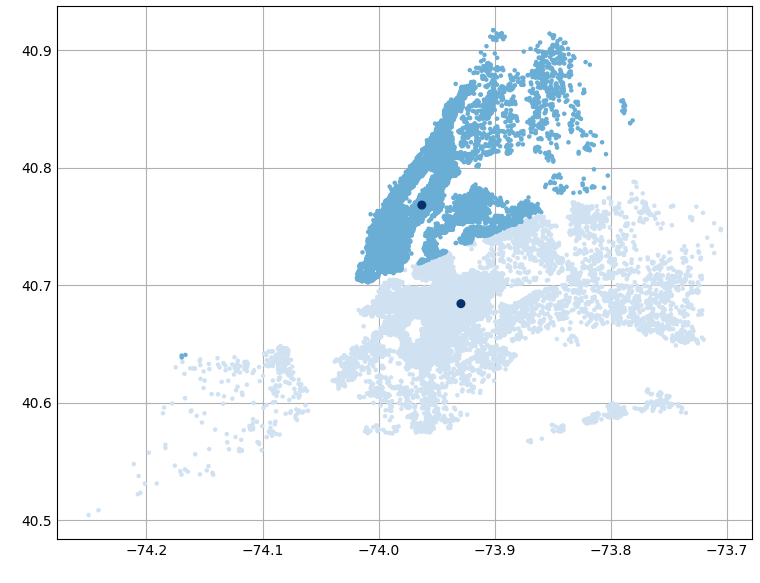
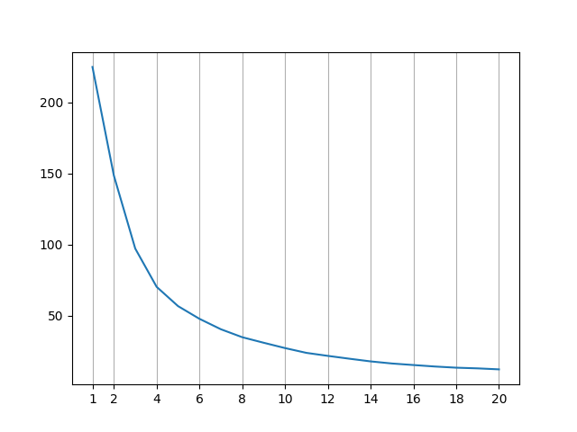
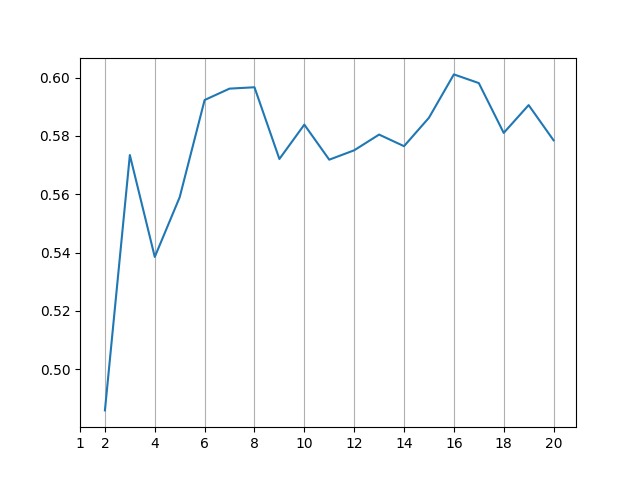

# distance

Big Data, Period 7

In this project, I explored how I could find the most optimal centroids for a given set of points, and how I could determine what the most optimal number of centroids is.

One can think of it as finding the centers of a cluster of points, and how many clusters exist for a given set of points.

## Scoring of the Centroids

To score each set of centroids, the total squared distance between each point and it's nearest cluster was used. The lower the score, the better.

Finding the scores goes a little like this:

1. Calculate the square distances between each of the coordinate points and each of the centroids.
2. For each point, find the smallest squared distance to a cluster.
3. Sum up the minimized square distances. That will be the score for that set of centroids.

For example: Say we have points (0, 0), (1, 0), (1, 1), (5, 1) and two centroid points, (1, 0) and (2, 1)

The squared distances between each of the points to the first centroid is 1, 0, 1, 17

The squared distances between each of the points to the second centroid is 5, 2, 1, 9

The distance between each of the points to it's nearest centroid (it's minimized squared distance) is 1, 0, 1, 9

The score for our two centroids is 11!

## Algorithms

To actually find the centroids, we'll have to do some data analysis on the points and centroids.

Below is a list and description of the algorithms I used to calculate the most optimal centroids. The stepping algorithms below were conceived and developed by me and was the first algorithm that came to my mind in solving this problem.

### Steps Original

As its name suggests, this is a "stepping" algorithm where I choose a random set of points, and then refine my guesses by simulating "steps" from those points to new points, and then checking if those new points yield better scores.

The original "steps" algorithm tries to find the set of two existing points (meaning that those centroid points are part of the set of all points) that best act as centroids. It goes like this:

1. Select two random points
2. Calculate the score. Use this score as our default record score.
3. Using the first centroid, simulate a step up, down, left, and right. Find the closest existing coordinate point to that point that is not our current point, and calculate the score with our new point.
4. If the score is lower than our record score, replace our current point with our new point.
5. If all the scores are higher than our record score, decrease the step size. The step size will keep decreasing until it has decreased for a predetermined amount of times, in which it'll stop decreasing.*
6. Swap the first and second centroids. (The algorithm only simulate steps on the first centroid, so swapping is necessary to optimize the second centroid as well.)
7. Repeat from step 3.
8. If our record has not changed for a predetermined amount of iterations (the limit) and we have reached our step dividing limit, end the loop and record those points as centroids.

\* Since this algorithm seeks to find the closest existing point, eventually, the step size will be so small that it will just alternate between a single point and the 4 points surrounding it, so I implemented a limit to make sure it doesn't loop forever.

And this algorithm was pretty good! It does have some inefficiencies with it's stepping and with limiting the number the iterations before it outputs it's final guess, but it is very fast and good enough to get the job done. Based on repeated testing, the record score using existing points is around **148.6347**, using the points **(40.68462, -73.92895)** and **(40.76801, -73.96361)** as centroids.

### steps_v1

Steps v1 is a modification to the original steps algorithm. Instead of calculating the existing two points that best serve as centroids, steps v1 attempts to calculate the actual centroids for a set of given points.

Aside from some minor modifications to the limits and stepping in the original algorithm, everything is about the same. The division factor and limit parameters were changed now that we're calculating the "real" centroid, and our final coordinates can be as precise as we want.

And this algorithm also worked extremely well! The lowest score that was found using this algorithm was 148.62222512609947, with the points (40.76814640404761, -73.96277106001035) and (40.684303488414216, -73.92910438405828) as centroids.

I wasn't happy with the algorithm though. It was slow, inefficient, only stepped in the 4 cardinal directions*, had bad final approximation determination, and supported only the calculation of two centroids. And so, I wrote the steps v2 algorithm.

\* It may just be that the most optimal point is *diagonal* to the current approximation, and unnecessary horizontal and vertical stepping decreases in step sizes may limit the ability of the algorithm to determine a better approximation and cause longer runtimes.

### steps_v2

Steps v2 is the improved and rewritten version of my step algorithms. It supports multiple centroid points, steps in the cardinal directions as well as the ordinal directions*, acts upon every single centroid in a single iteration**, has separate limits for stepping and determining the final approximations, tracks the current record and steps size and smartly determines if the current set of centroids are potential candidates for new records\***, among other changes.

\* I was considering using only 4 or 6 directions, and then changing the angles for those directions upon not finding a new record, but it turns out none of this was even necessary! Due to the nature of the decreasing step sizes, we could reach a point diagonal to the current point using just smaller steps in the x and y directions, though it is way slower and limits the effectiveness of future movements.

** As opposed to the original algorithm, which acts only on the first centroid and then swaps the centroids at the end in order to step with both points.

*** Along with a global minima, there also exists several local minimums. Since the v2 algorithm is a bit slower than the v1 algorithm (because it uses loops in several places now that it supports multiple clusters and steps in 8 directions) and attempts to refine and get more precise coordinates, it is imperative that the algorithm doesn't get caught up calculating these local extremas. Thus, I've implemented a way for the algorithm to identify if the current set of centroids are potential record candidates or just local extremas.

The newly written and improved algorithm found a best score of 148.6222251260992, with centroids (40.6843034858625, -73.92910438494935) and (40.76814640433521, -73.96277106235226), a mere 0.00000000000027 improvement over the record found using steps v1.

(Which really just goes to show how great the original algorithm is, as inefficient as it was. And repeated iterations of v1 would've probably given us a score like this anyways if I had changed the limits to be a bit higher.)

### K-Means

The *mathematical* way of solving this problem. The algorithm is as follows:

1. Pick any set of points. These will be our initial guesses.
2. For each centroid, find the set of all points which is closest to this centroid.
3. Find the means of those points. Set the coordinates of the centroid to the mean.
4. Using the new set of centroids, find the set of all points closest to the centroid.
5. If that number has not changed from the previous set, then no points have moved. We've found our centroid.
6. Otherwise, repeat from step 3.

This method is very fast because it performs an analysis on single sets of points, as opposed to the stepping algorithms, which required multiple calculations as we had to simulate stepping into a specific direction.

Curiously enough, this math based algorithm performed worse than both step v1 and step v2, with a record score of 148.62222512610143 with the points (40.68430348416799, -73.92910438336149) and (40.768146405304556, -73.96277106052257) as centroids.

There are two possible explanations for this: Either Python's maths calculations results in precision loss when calculating the means of numbers*, or maybe the mathematical method does not in fact return the true global minimum squared distances. (I'm not a mathematician so I'll have to read into it.)

### Plotting

Step v2 and the K-Means algorithm supports plotting of it's centroids and points. When calling the function, set the `plot` argument to true.

Some plots can be found in the `plots/` folder.

## Judging

Below are the two "judging" algorithms I made to try and find the optimal number of clusters. 

### Elbow

Goes through the record files for each number of clusters, finds the minimum score, and plots a line graph of the scores. The "elbow" of the graph will be our optimal cluster count, as adding more clusters after the "elbow" will only provide marginal decreases to the records.

### Silhouette

Goes through the record files, finds the best centroids, then for each point, calculate the difference in squared distance between the closest centroid and the next closest centroid divided by the squared distance of the next closest centroid. Average up this "score" and plot it for each number of clusters.

The higher the silhouette score, the better, as it means that the cluster "fits" in the current cluster, and that points from other clusters are very far away.

Sometimes it doesn't really say much. Like in the example above. But other times, it can help determine the optimal number of clusters because if the silhouette value starts going down, we know that some clusters are rather redundant since the points can readily associate themselves with another cluster without adding much too much weight to the squared distance metric.

## Conclusion

Overall, a pretty insightful project about clusters, machine learning, and data science! I'm finally learning some actual computer *science* and applying it to solve some "real world" problems.

## Learn More

[Cluster Analysis](https://en.wikipedia.org/wiki/Cluster_analysis)

[K-Means](https://en.wikipedia.org/wiki/K-means_clustering)
